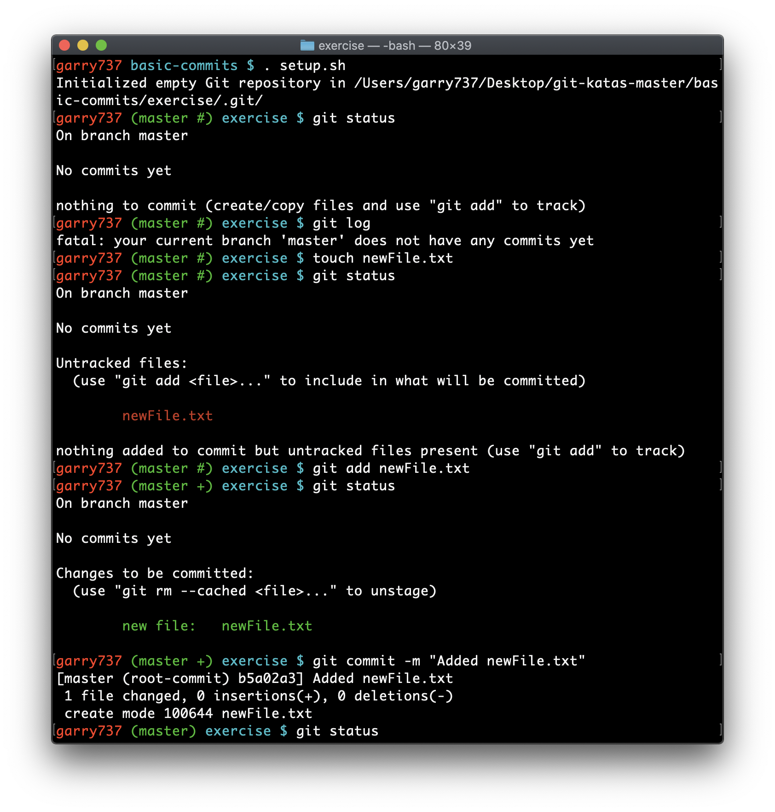
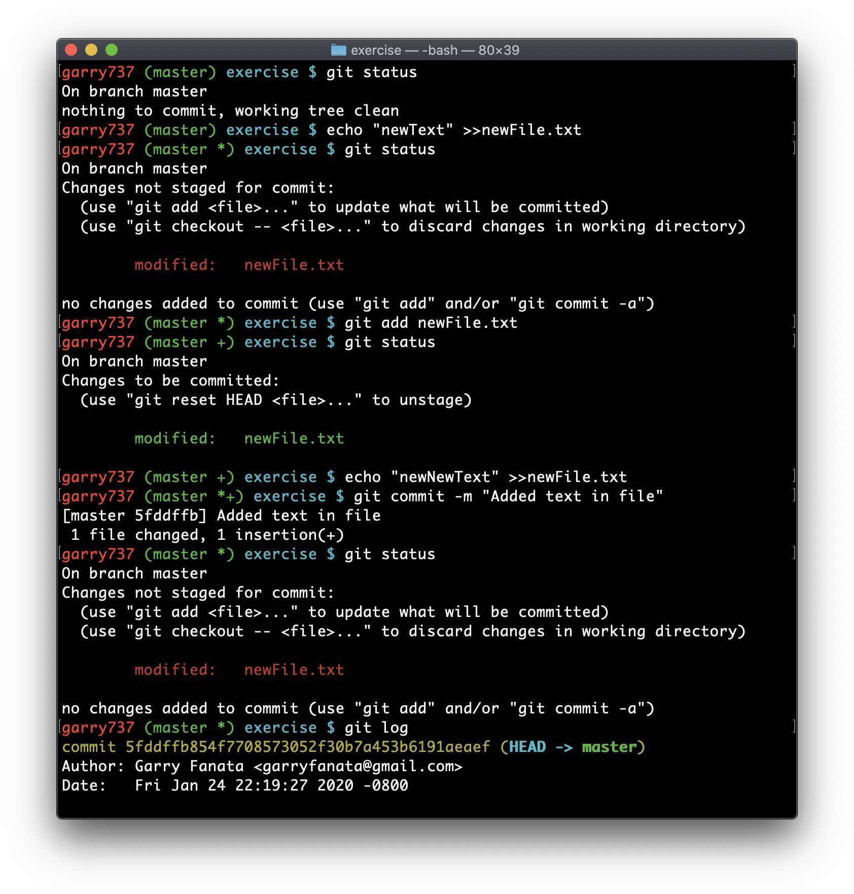
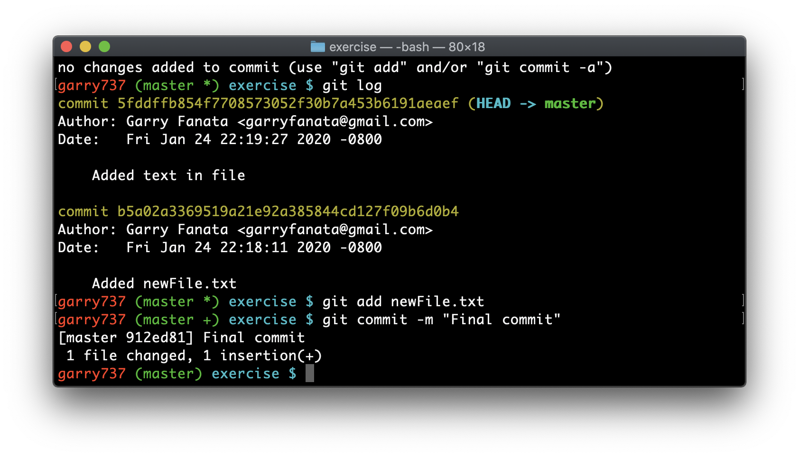

# Git Kata: Basic Commits
## Answers

This kata will introduce you to the `git add` and `git commit` commands.

This is a very introductory kata. if you have used `git status`, `git log --oneline --graph`, `git add` and `git commit` extensively you should probably skip it.

You can look at the bottom of this file, if you have not yet done basic git configuration.

## Setup:

1. Run `. setup.sh` (or `.\setup.ps1` in PowerShell)

## The task

1. Use `git status` to see which branch you are on.
2. What does `git log` look like?
3. Create a file
4. What does the output from `git status` look like now?
5. `add` the file to the staging area
6. How does `git status` look now?
7. `commit` the file to the repository
8. How does `git status` look now?
9. Change the content of the file you created earlier
10. What does `git status` look like now?
11. `add` the file change
12. What does `git status` look like now?
13. Change the file again
14. Make a `commit`
15. What does the `status` look like now? The `log`?
16. Commit the newest change

## Useful commands
- `git add`
- `git commit`
- `git commit -m "My commit message"`
- `git log`
- `git log -n 5`
- `git log --oneline`
- `git log --oneline --graph`
- `touch filename` to create a file (or `sc filename ''` in PowerShell)
- `echo content > file` to overwrite file with content (or `sc filename 'content'` in PowerShell)
- `echo content >> file` to append file with content (or `ac filename 'content'` in PowerShell)

## Git Initial Configuration
1. `git config --global user.name "John Doe"`
1. `git config --global user.email "johndoe@example.com`

For the vim scared:
- `git config --global core.editor nano`

For the windows peeps:
- `git config --global core.editor notepad`

Other editor options:
- `git config --global core.editor "atom --wait"`
- `git config --global core.editor "'C:/Program Files/Notepad++/notepad++.exe' -multiInst"`
